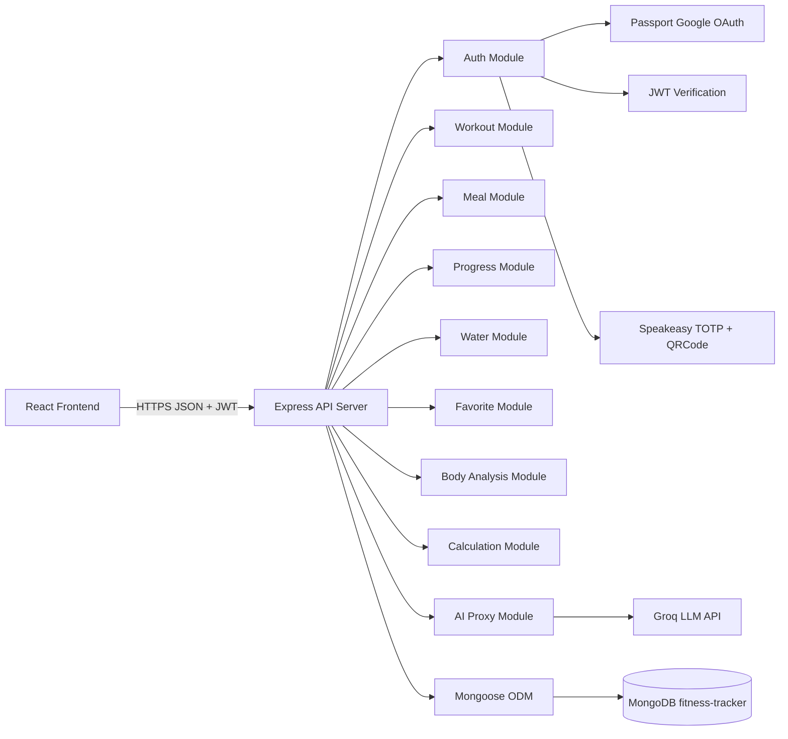
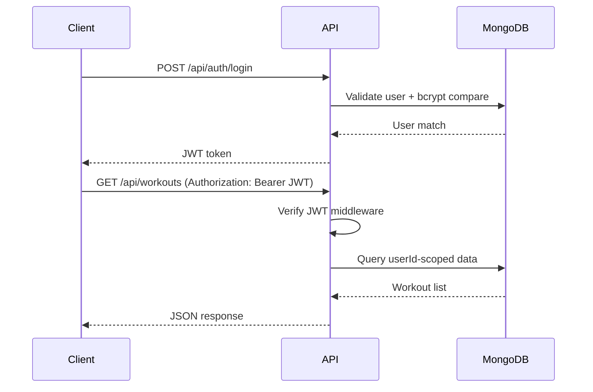
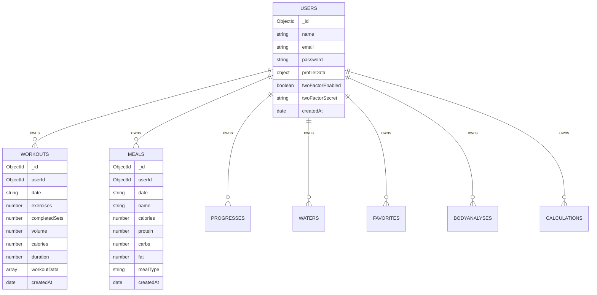

# AI-Powered Fitness Tracker - Backend Application

## 1. Title And Group Details

**Module:** ICT3230 Backend Development  
**Assignment:** IA3 - Backend Application Report  
**Project Title:** AI-Powered Fitness Tracker - Backend Application  
**Submission Date:** 10 April 2026

| Field | Details |
|---|---|
| Group Number | [Enter Group Number] |
| Group Name | [Enter Group Name] |
| Member 1 | [Name] - [Enrollment Number] |
| Member 2 | [Name] - [Enrollment Number] |
| Member 3 | [Name] - [Enrollment Number] |
| Member 4 | [Name] - [Enrollment Number] |

---

## 2. Project Abstract

The AI-Powered Fitness Tracker backend is a REST API system developed using **Node.js**, **Express.js**, and **MongoDB (Mongoose ODM)**. The backend supports secure multi-user fitness tracking with authentication, authorization, analytics, and AI-assisted features.

The system provides APIs for user onboarding, profile management, workout logging, meal tracking, hydration logs, body analysis, fitness calculations, and exercise favorites. Security is implemented with **JWT-based authentication**, **password hashing using bcrypt**, **Google OAuth 2.0 login**, and optional **Two-Factor Authentication (2FA)** using TOTP.

The backend also integrates an AI proxy endpoint for fitness chat assistance while protecting API keys server-side. The architecture is modular and environment-configurable, with CORS policy controls and payload-size safeguards.

### Core Functional Outcomes

- User account creation, login, profile update, and password change.
- Secure protected CRUD endpoints for all fitness domains.
- Date-based and historical tracking suitable for charts and dashboard analytics.
- 2FA enrollment, verification, and disable workflows.
- OAuth sign-in and controlled redirect flow.
- AI chat endpoint with authentication and request constraints.

---

## 3. High-Level Design

### 3.1 Backend Architecture Overview

### 3.2 Request And Security Flow

### 3.3 Database Architecture

### 3.4 Module Breakdown

| Module | Responsibility |
|---|---|
| server.js | App bootstrap, middleware registration, CORS, body parser, route mounting, error handling |
| auth.js | Signup, login, JWT profile flow, password change, Google OAuth, 2FA lifecycle |
| workouts.js | User workout create/read/delete with volume and session metadata |
| meals.js | User meal create/read/delete including date and macro values |
| progress.js | Body measurement/progress logs with notes and photo entries |
| water.js | Daily hydration upsert and retrieval |
| favorites.js | Favorite exercises add/list/remove with uniqueness control |
| bodyAnalysis.js | Save and manage AI/body assessment plans |
| calculations.js | Save/list/delete BMI/BMR/TDEE/MACROS calculations |
| ai.js | Authenticated proxy for AI chat service with request limits |

---

## 4. Components And Concepts Used

### 4.1 Technology Stack

| Category | Component | Purpose |
|---|---|---|
| Runtime | Node.js | Backend execution environment |
| Framework | Express.js | Routing and middleware pipeline |
| Database | MongoDB | NoSQL document storage |
| ODM | Mongoose | Schemas, models, validation, queries |
| Auth | JSON Web Token | Stateless session authorization |
| Password Security | bcryptjs | Password hashing and verification |
| OAuth | passport + passport-google-oauth20 | Google sign-in integration |
| 2FA | speakeasy + qrcode | TOTP generation/verification and QR provisioning |
| Config | dotenv | Environment-based configuration |
| API Client | fetch/axios | External AI service communication |
| API Protection | CORS + auth middleware | Origin restrictions and route protection |

### 4.2 Mongoose Models

| Model | Main Data Purpose |
|---|---|
| User | Identity, credentials, profile, 2FA state |
| Workout | Session-level workout metrics and exercise arrays |
| Meal | Nutrition entries per date and meal type |
| Progress | Body metrics, photos, and notes over time |
| Water | Daily hydration amount and goal |
| Favorite | Saved exercise references |
| BodyAnalysis | AI/body plan records and focus areas |
| Calculation | Stored fitness calculator outputs |

### 4.3 API Endpoint Inventory

| Route Group | Base Path | Methods |
|---|---|---|
| Health | /api/health | GET |
| Authentication | /api/auth | POST, GET, PUT |
| Workouts | /api/workouts | GET, POST, DELETE |
| Meals | /api/meals | GET, POST, DELETE |
| Progress | /api/progress | GET, POST, DELETE |
| Water | /api/water | GET, POST, DELETE |
| Favorites | /api/favorites | GET, POST, DELETE |
| Body Analysis | /api/body-analysis | GET, POST, PUT, DELETE |
| Calculations | /api/calculations | GET, POST, DELETE |
| AI Chat | /api/ai/chat | POST |

---

## 5. Screenshots And Descriptions

To keep the report simple and within page limits, use the **minimum evidence set** below.
If your lecturer did not enforce an exact figure count, these 4 screenshots are enough to prove backend implementation.

| Figure | Screenshot To Insert | Description |
|---|---|---|
| Figure 1 | Postman login success (`POST /api/auth/login`) | Shows status 200 and returned JWT token |
| Figure 2 | Protected request success (`GET /api/workouts`) with `Authorization: Bearer <token>` | Proves JWT middleware validation and user-scoped data access |
| Figure 3 | MongoDB Compass: `users` + `workouts` collections | Confirms persistence and `userId` relationships |
| Figure 4 | One CRUD module flow (recommended: `meals`) | Show `POST /api/meals` success and `GET /api/meals` returning saved record |

### Optional Extra Figures (only if you have time)

- 2FA setup/verify response.
- Google OAuth callback success.
- AI chat proxy endpoint response.

Suggested caption format:  
**Figure X:** [Short title] - [What this proves in backend behavior]

---

## 6. Individual Contributions

Replace this table with your actual team allocation.

| Member Name | Enrollment Number | Backend Contribution |
|---|---|---|
| [Member 1] | [ID] | Designed server architecture, middleware setup, and environment configuration |
| [Member 2] | [ID] | Implemented authentication, JWT flow, password security, and profile updates |
| [Member 3] | [ID] | Built workout/meal/progress/water/favorites APIs and model schemas |
| [Member 4] | [ID] | Integrated OAuth, 2FA, calculations/body-analysis/AI routes, testing and debugging |

---

## 7. Conclusion

The backend application successfully meets the IA3 backend development objectives by delivering a secure, modular, and production-oriented fitness API platform. The implementation demonstrates practical use of modern backend engineering concepts including RESTful route design, token-based authentication, OAuth, 2FA, and document-based data modeling.

The final system supports full CRUD operations, user-scoped access control, robust integration with frontend modules, and extensibility for AI-assisted functionality. Overall, the project provides a complete backend foundation suitable for academic evaluation and real-world enhancement.

---

## 8. Submission Checklist

| Item | Status |
|---|---|
| Backend report content completed | [ ] |
| Group details filled | [ ] |
| Individual contributions filled | [ ] |
| Screenshots inserted with captions (minimum 4) | [ ] |
| Exported to PDF (max 5 pages) | [ ] |
| Source code zipped without node_modules | [ ] |
| Correct file names applied | [ ] |

Required final filenames:

- Groupname_ICT3230_Backend_Report.pdf
- Groupname_ICT3230_Backend_Code.zip
